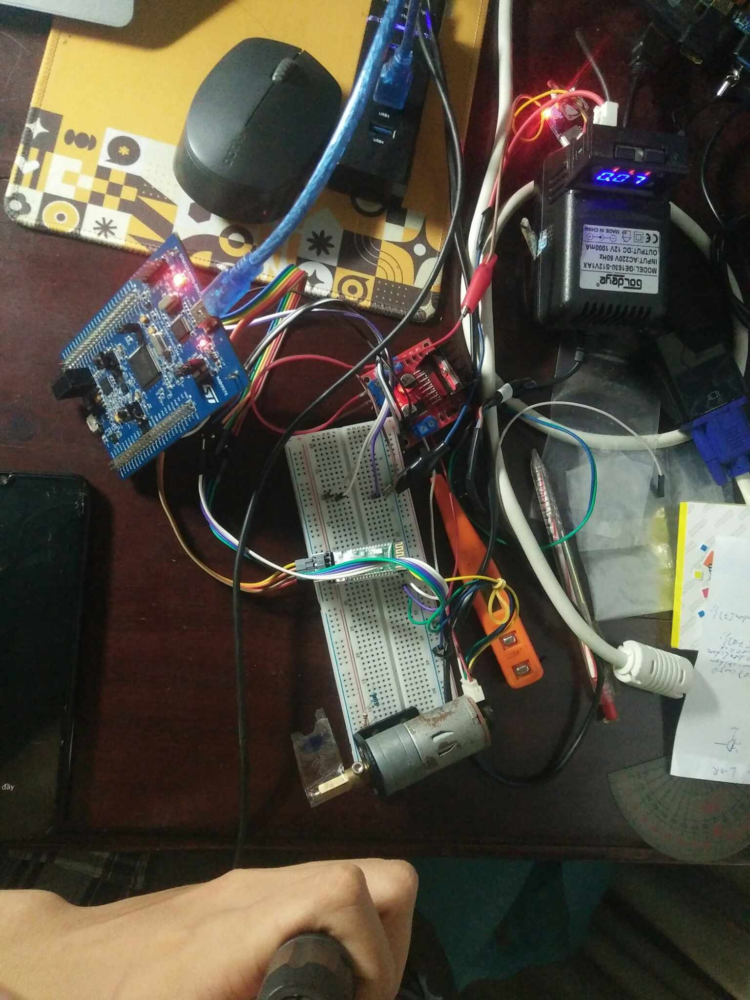
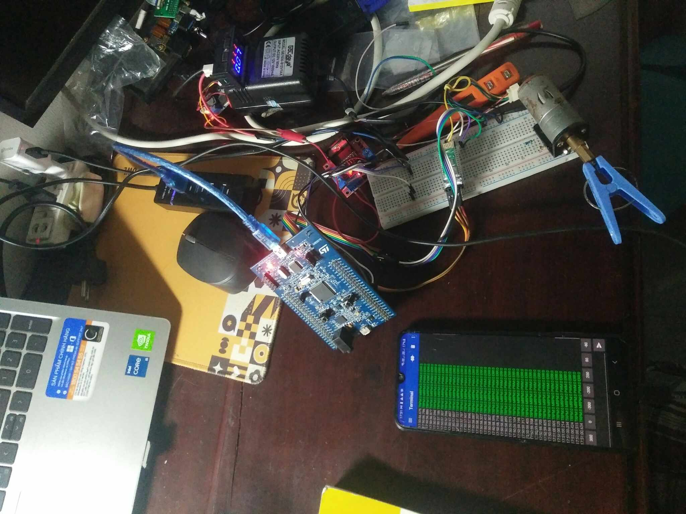

# Project: PWM-Based DC Motor Controller with Speed Monitoring via bluetooth device
This project demonstrates how to control a DC motor with an encoder using the STM32F407. It involves a closed-loop control system that uses Pulse Width Modulation (PWM) for speed control, an H-bridge motor driver for direction control, and a timer in encoder mode to read the motor’s actual speed and position.
The main components include:
- **STM32F407VG**
- **GA25-370 DC motor**
- **L298N DC motor driver**
- **JDY-24M Bluetooth module**
  
Using these components, the DC motor can be controlled wirelessly via a Bluetooth connection. The PWM values are displayed on a Bluetooth monitoring application running on a smartphone or laptop.
# Software
The project was programmed using Keil C and is efficient and reliable in operation.
# Demonstration
  ## Breadboard Implementation:

  ## PCB Implementation:

